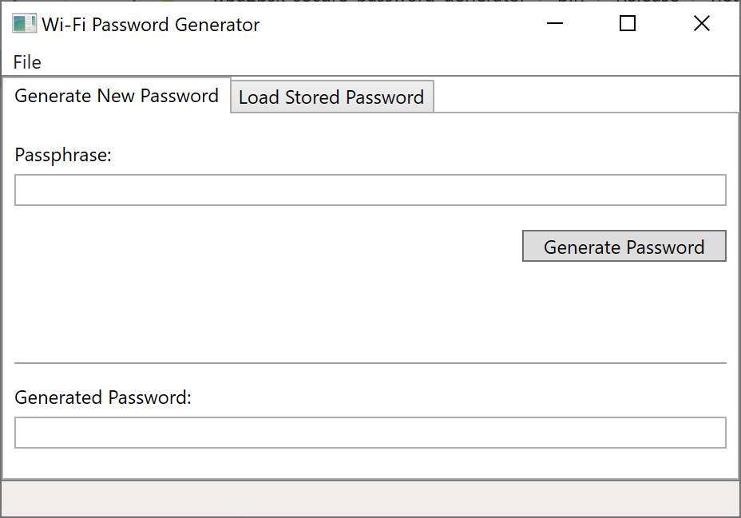
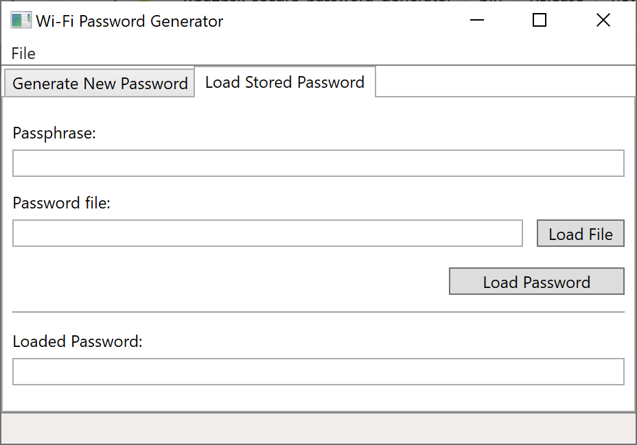

# Wi-Fi Password Generator

Generates Wi-Fi passwords for WPA2-PSK networks.

Target Framework: .NET Core 3.1

## Usage

To generate a password:
1. Select the "Generate New Password" tab
1. Enter a memorable passphrase (will need it to retrieve your password later in time)
1. Click the "Generate Password" button
1. Choose a file location to save your encrypted password to and "Save"
1. Copy the generated password and use it appropriately

To load in a generated password:
1. Select the "Load Stored Password" tab
1. Enter the passphrase used to generate the Wi-Fi password
1. Use the "Load File" button to select the encrypted password file
1. Click the "Load Password" button
1. Copy the loaded password and use it appropriately

## Platform-specific publishing steps

If you want to publish a single-file executable application, you need to publish for each configuration, such as Linux x64, Linux ARM64, Windows x64, and so forth. Single-file apps are always OS and architecture-specific.

## Screenshots

### Generate New Password

### Load Stored Password

### Single-File Executable, Self-Contained

https://docs.microsoft.com/en-us/dotnet/core/deploying/single-file#publish-a-single-file-app---visual-studio

Pros:
* Control .NET version
* Platform-specific targeting

Cons:
* Larger deployments
* Harder to update the .NET version

### Single-File Executable, Framework-Dependent

https://docs.microsoft.com/en-us/dotnet/core/deploying/#publish-framework-dependent

Pros:
* Small deployment
* Cross-platform
* Uses the latest patched runtime

Cons:
* Requires pre-installing the runtime
* .NET may change